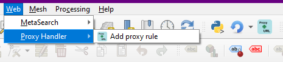

## QGIS Prefix Proxy URL

Used for adding a **prefix** proxy to specific URLs, i.e. their addresses are built in the following way:

`[https://proxy.server.url/proxy]?[https://the.service.you/need/probably/arcgis/rest/services]?[url_params=their values]`

This is needed because QGIS allows setting a global proxy, but not a prefix proxy, and not for specific URLs. For Layers that
need other URL parameters (like OGC WMS/WFS/etc. or ArcGIS REST), the question mark (?) in the middle of the URL causes QGIS to
drop the necessary second question mark and construct the other URL parameters poorly.

Without the second question mark, adding these types of layers is impossible,
It's also really annoying trying to get their data,
The script adds a simple prefix proxy to all requests which start in the handler's URL.

Until this gets approval in the plugin repository, 
you can install using the `Plugins`->`Manage and install plugins`->`Install from ZIP` dialog

### How to use the plugin after installation?

You can find the plugin under the `Web` tab or the `Plugins` toolbar

1.  Add whatever handlers you want to use to the table with the `URL` and `Proxy URL` (don't forget to click on <kbd>Add handler</kbd>)

Don't add a question mark at the end of the `Proxy URL`
2. Click OK
3. Add the layer with only the URL as a connection, if a referer is needed, add that as well.
4. The layer should load now, if not, try refreshing the connection